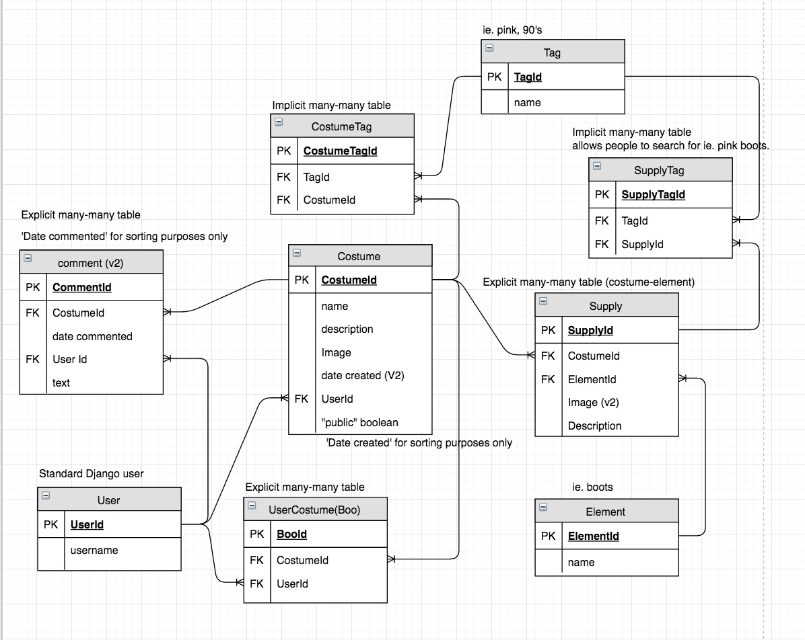
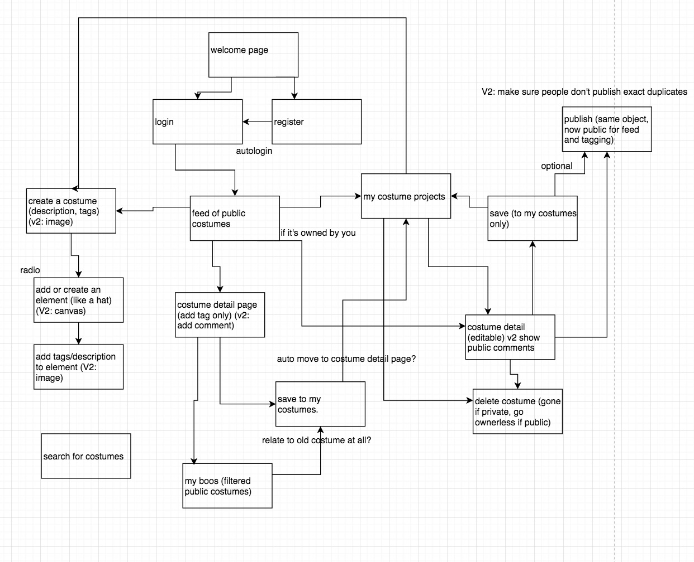

# Halloween Costume Database

**Author**: Megan Ford September-October 2016 

What started as my Nashville Software School Final Capstone Project to display all I have learned through 6 months of full-time developer bootcamp is now an ongoing passion project. V1 written in 7 days. Full-stack application written in Python/Django and Javascript/Angular 1/Bootstrap. Fully custom RESTful API back-end, Firebase image upload, Django user authentication.

Search for costumes by what you have in your closet or what you'd like to wear, recipe-style, using costume-level tags, supply-level tags, and supply categories. 'Boo' (like) and tag costumes other people have built, save them to edit for your own, or build an idea from scratch.

##### License: [MIT](LICENSE.md)

