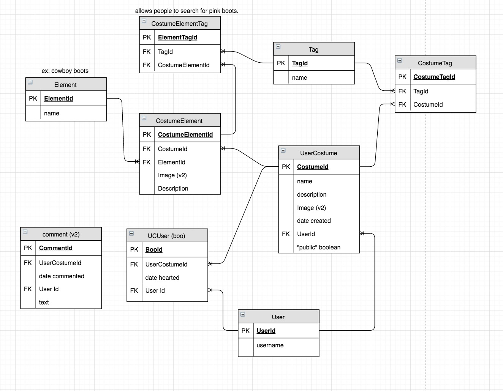

# Nashville Software School Final Capstone: Halloween Costume Database

**Author**: Megan Ford September 2016 

Final Capstone Project to dipslay all I have learned through 6 months of full-time developer bootcamp at Nashville Software School. Full-stack application written in python/django and javascript/angular. Fully custom RESTful API back-end, Django user authentication. 

Search for costumes by what you have in your closet or what you'd like to wear. Heart and tag costumes other people have built, save them to edit for your own, or build an idea from scratch.

##### License: [MIT](LICENSE.md)

